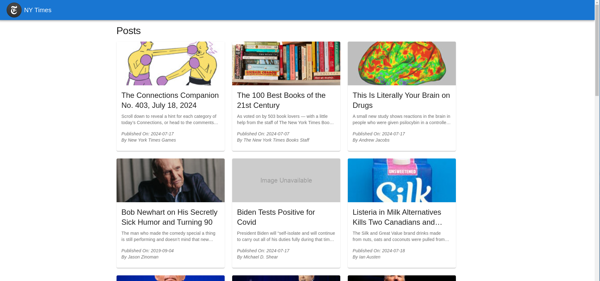
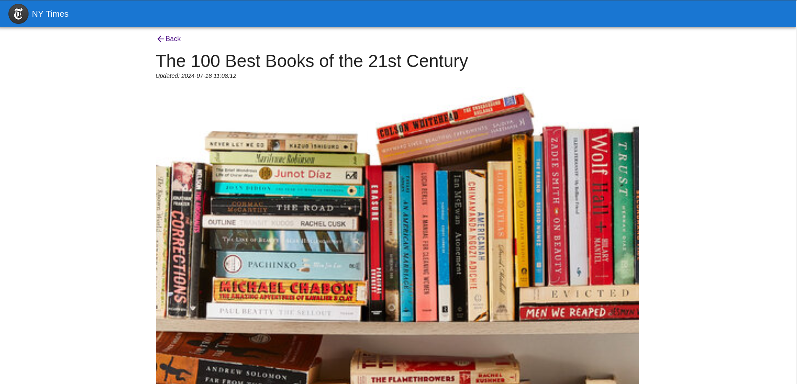

## NY Times

### Description

This project is a web application that fetches and displays articles from the New York Times Most Popular API. Users can view popular articles and see detailed information about each article.

Following are the routes/pages present in this application -

1. Master/List page - this page will fetch the most popular API from New York Times API and displays it using Grid layout
2. Details Page - this page will display the details of the selected article

### Screenshots

1. Master/List Page
   

1. Details Page
   

### Installation

1. Clone the repository:
   ```
   git clone <repository-url>
   ```
2. Change directory to the newly cloned folder:
   ```
   cd ny-times
   ```
3. Install dependencies:

   ```
   npm install
   ```

   OR

   ```
   yarn
   ```

### Usage

To start the development server, run:

```
npm start
```

OR

```
yarn start
```

The application will run default in Port 3000. Access it via web browser at http://localhost:3000

### Tech stack

- `React v18.2`
- `React Router v6`
- `Redux Toolkit with RTK Query v2`
- `Material UI v5`
- `React testing library`
- `Jest`
- `Cypress`
- `ESlint` for linting
- `Prettier` for code formatting
- `SonarQube` for code anaylsis

### Scripts

- `start`: Start the development server.
- `build`: Build the application for production.
- `test`: Run tests using Jest.
- `coverage`: Run tests with coverage report.
- `eject`: Eject the application from Create React App.
- `prepare`: Installs necessary pre-commit/push hooks from husky library
- `lint`: Lints JavaScript/TypeScript files.
- `lint:fix`: Uses ESLint to fix any potential problems.
- `format`: Formats code using prettier
- `cypress`: Executes Cypress E2E tests
